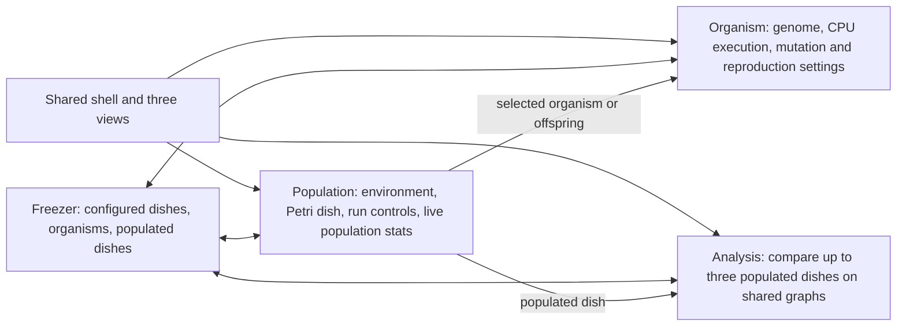

# Avida-ED 4 to Avida-ED 5 POC interface map

This map records the Avida-ED 4 interface that existing tutorials teach, then compares it with the functional controls in the Avida-ED 5 proof of concept. Its purpose is practical: use the same names, group the same actions in familiar places where possible, and make unavoidable changes visible before they surprise a returning user.

The Avida-ED 4 baseline is commit [`fcfc5c60`](https://github.com/Avida-ED/Avida-ED4/commit/fcfc5c60e03479c85eadad083ffb5e7d92a95781) in `Avida-ED/Avida-ED4`, inspected on 2026-09-30. The checked source identifies the app as version 4.0.33. The linked Quick Start Manual is v3.0 and is therefore supporting context, not the authority for v4-only behavior. The current Avida-ED help page links the App Intro, Organism View, and Freezer Panel videos.

## Conceptual map

This flow is the tutorial-relevant contract: users move organisms, populations, and configured environments among the Freezer and the three named views. “Viewer Chooser” describes a navigation control rather than a user task; the Avida-ED 4 application itself names the buttons Population, Organism, and Analysis.

## Avida-ED 4 reference map

The labels and option lists below come from the v4 app source. Limits and defaults are included where the source enforces or initializes them. A value marked “not established here” should be checked against the exact tutorial/demo build before using it as an acceptance criterion.

| Area | Label or element | Values, choices, and behavior | Metadata and evidence |
|---|---|---|---|
| Navigation | Population / Organism / Analysis | Three persistent view buttons with the corresponding legacy icons. | Exact labels and order in v4 `index.html`; direct switching in `avidaED.js`. |
| Shared | Freezer | Configured Dishes, Organisms, Populated Dishes, and a Test Dishes section. Items can be dragged to the relevant work surface; menu actions also save, load, rename, export, and delete items. | Test Dishes is a development/test section. Primary categories and menu actions are in v4 `index.html`. |
| Population · setup | Dish Size | Columns × rows; initial value 30 × 30. | The checked UI accepts numeric values greater than 0 and at most 100 per dimension. I found no explicit integer-only check in this handler; confirm fractional-value behavior against the engine before documenting it as allowed. |
| Population · setup | Per Site Mutation Rate | Default 2%; text entry and logarithmic slider. | Accepted range 0–100% inclusive. Slider position is transformed as `10^(position/200) − 1`; this is a control scale, not a linear percent scale. |
| Population · setup | Ancestral Organism(s) | Drag one or more organisms into the ancestor box; geometry controls can be shown or hidden. | Ancestry and advanced geometry are configured before starting the run. |
| Population · setup | Place Offspring | Near their parent / Anywhere, randomly; random is selected in the checked-in HTML. | Radio alternatives; disabled during a run. |
| Population · surface | Mode (cell coloring) | Fitness (initial selection), Offspring Cost, Energy Acq. Rate, Ancestor Organism, nine task-resource views (Notose through Equose), and None. | Resource choices are environment-dependent. Fitness/cost/rate are continuous measures; ancestor and resource modes use the selected map/legend. |
| Population · surface | Zoom | Slider controlling the Petri-dish scale. | The exact numeric extent is defined by script/UI initialization and is not a tutorial-facing setting listed in the checked manual text. |
| Population · transport | Freeze / New / Run or Pause / Forward | Save the current population/configuration; start a new experiment; toggle run/pause; execute one update. | Setup dimensions and mutation controls lock while the population runs. |
| Population · stats | Setup / Stats / Test Setup tabs | Setup exposes environment controls; Stats exposes selected-organism and population statistics; Test Setup provides a separate test-dish workflow. | Panel selection is separate from the three main views. |
| Organism | Cycle and transport | Cycle slider/readout plus Reset, Back, Run, Forward, and End. | Operates an organism trace through instruction execution. Some controls begin disabled until an organism is loaded. |
| Organism · settings | Repeatability Mode | Experimental (Natural Variation) / Demo (forces exact replay). | Two radio alternatives. |
| Organism · settings | Per Site Mutation Rate | Numeric percent plus slider; default is 2%. | Input validation accepts 0–100% inclusive. |
| Analysis | Population traces | Up to three populated dishes can be placed in the analysis chart. Each trace can be removed and assigned a color. | The three slots are present in v4 `index.html`; trace colors can be Red, Blue, Green, Yellow, Orange, Purple, Cyan, Magenta, or Black. |
| Analysis | Left and right y-axis selectors | None, Average Fitness, Average Offspring Cost, Average Energy Acq. Rate, Number of Organisms, Number Viable. | Two independent selectors; the left axis is drawn thicker and the right axis thinner. |
| File / Freezer / Control menus | Save/open/export and run commands | Save workspace / Save As / Open Default / Open; Import Freezer Item; Export Data / Export Graphics; save or load Freezer items; Run, Pause, Forward, New, selected organism/offspring to Organism, populated dish to Analysis. | Exact menu labels in v4 `index.html`; actions expose workflows also shown in the tutorials. |

The embedded Environment/Test Setup editor has a broader configuration surface than this compact crosswalk: it can define task rewards and spatial resources. Use the app’s `helpEnvironment.html` and a named tutorial fixture when comparing those advanced controls; do not infer all of their valid ranges from the short table above.

## Avida-ED 5 POC functional-control map

Only controls with an implemented action or data path are listed. Disabled placeholders and decorative labels are excluded. Source paths point into this repository.

| Area | Current label / control | Values and enforced metadata | Relation to v4 |
|---|---|---|---|
| Navigation | Population / Organism / Analysis | Three main-view buttons. Analysis currently opens the completed-run comparison workspace and becomes available after two runs complete. | Labels and icons now follow v4. Analysis behavior is a purposeful first slice, not yet v4’s three-population analyzer. |
| Shared | Freezer | Organisms, saved configurations, and portable checkpoints; load, download, rename, remove, save, and import actions are implemented. | Same durable-work purpose; item categories, affordances, and drag/drop paths are not yet a one-for-one replica of v4. |
| Population · experiment | Experiment preset | Mutation variation · every update: target 250, sample every update. Quick check · every 10 updates: target 100, sample every 10 updates. | New lesson presets; v4 instead starts from a configurable environment. |
| Population · experiment | Mutation treatment | 0% mutation / 1% mutation. | Two controlled alternatives, versus v4’s numeric 0–100% range. The displayed per-site percentage is read-only and follows the selected treatment. |
| Population · experiment | Random seed | 42, 43, or 44; default 42. Step 1; the callback rejects values outside these three seeds. | New reproducibility scaffold. This is narrower than arbitrary v4 run variation by design. |
| Population · experiment | Stop at update | Positive integer, 1–10,000; default 250 for the full preset and 100 for Quick Check. | POC run-length control. It does not correspond to v4’s dish-size or environment controls. |
| Population · surface | Population grid | Fixed 10 × 10 grid; fixed bundled ancestor and environment. | Same spatial population task, but the grid, ancestor, CPU/instruction set, and ten task rewards are held constant in this lesson. |
| Population · transport | Reset / Step / Play / Fast-forward / Pause / Run to target | Step is one population update; Play runs up to 10 updates/s; Fast-forward batches updates; Run to target stops at the configured update. Controls lock according to run state. | Similar transport roles; labels, layout, and batch behavior differ from v4’s Run/Pause/Forward/New row. |
| Population · display | Color by | Blank; module-provided categorical modes (Phenotype, Genotype); continuous modes (Gestation Cost, Metabolic Rate, Fitness). Continuous palettes: Gnuplot 2, Viridis, Cubehelix. | Fitness/cost/rate map to familiar concepts. v4’s task-resource and ancestor choices are not all present as equivalent display modes. |
| Population · evidence | Population, Sequence Richness, Ancestor Sequence (%) charts and observation table | Sample cadence follows the selected preset. Sequence richness is distinct ordered sequences present at that update; ancestor sequence is exact sequence identity. | New explicit lesson evidence set. v4’s population statistics and graph series are broader and use different terminology. |
| Organism | Freezer selector, execution timeline, Reset / Step / Play / Pause / Fast-forward, View offspring | Selector loads a saved organism; timeline spans 0 through that organism’s execution length in steps of 1. Play is 2 instructions/s; Fast-forward is 20 instructions/s. Genome, registers, stacks, memory, tasks, and traits are rendered for the loaded organism. | Same organism inspection purpose, with a different execution layout and added state panels. It does not reproduce the v4 cycle/settings arrangement exactly. |
| Configuration | Settings and Environment tabs | Controls derive from Avida setting metadata: closed option sets become selects; bounded numeric settings get range and number inputs with metadata min/max; startup-only controls lock after a run begins. Reactions and events have implemented add/remove/edit actions. | Shares environmental-configuration goals. Layout, exposed subset, and task-configuration path need tutorial-by-tutorial comparison. |
| Analysis | Completed-run comparison | Requires two completed runs. Overlays completed population-size and sequence-richness trajectories; endpoint rows include population, richness, and ancestor fraction. Colors identify treatment. | Current Analysis is deliberately narrower than v4: it compares recorded POC runs, while v4 analyzes up to three populated dishes with selectable measures and axis/color controls. |
| Records | Prediction / Observations / Save experiment JSON / Export CSV | Notes travel with a saved experiment; recorded run samples can be exported. | New instructional and data-portability features; no direct v4 tutorial counterpart. |

### Confidence and verification

The view labels, v4 population setup values, coloring choices, Analysis selectors, and POC numeric limits above are high-confidence because they are explicit in checked-in source. The POC feature list is high-confidence for source-defined callbacks and metadata; browser layout and tutorial equivalence remain medium-confidence until checked at representative desktop/mobile widths and against the exact videos. The official help page links three tutorial videos, but their complete transcripts were not available in the material inspected for this map.

## Consilience assessment

The navigation correction is now direct: **Population / Organism / Analysis**, with no “Viewer Chooser” heading. Spanish uses the corresponding **Población / Organismo / Análisis** labels. The POC’s Analysis title is also “Analysis,” while its text describes the current completed-run comparison capability.

The strongest tutorial mismatch is structural, not cosmetic. In v4, learners configure a 30 × 30 Petri dish, mutation rate, ancestors, and offspring placement in a right-hand Setup panel, then use the Petri dish, organism trace, or three-population Analysis view. The POC’s first lesson fixes most evolutionary context and exposes a small experiment contract beside a 10 × 10 map. That improves controlled comparison but changes where and how a tutorial’s actions are performed.

| Tutorial concept | POC state | Significance for tutorial use |
|---|---|---|
| Three main view names and icons | Aligned after this revision | Low risk once the removed heading no longer pushes controls down. |
| Population run/step/pause | Partial | Same jobs, but grouped differently and includes a target-update workflow. Tutorial screenshots may not point to the same button location. |
| Mutation and world setup | Deliberately constrained | The 0%/1% treatments, fixed 10 × 10 world, fixed ancestor, and fixed rewards cannot reproduce tutorials that vary rate, dish size, ancestors, or placement. |
| Population color modes | Partial | Fitness, cost, and metabolic-rate concepts overlap. Resource and ancestor modes remain tutorial-specific gaps. |
| Organism execution | Partial | Users can inspect execution and advance instructions, but timeline layout, speed, and settings controls differ from v4. |
| Analysis | Partial, high-impact | The view name matches; capability differs. A tutorial that sends a populated dish to Analysis and chooses y-axis series will not map onto today’s run-comparison workspace. |
| Freezer transfers | Partial | Saving and reopening artifacts are supported, but tutorial DnD and item-category expectations should be tested against each video. |
| Added lesson records and pinned experiment presets | Intentional additions | These extend the teaching workflow without replacing v4 concepts. They should be presented as new features, not implied tutorial steps. |

## Recommended use of this map

Treat the Avida-ED 4 table as a small interface contract, then add a row to the comparison table whenever a functional POC control is added or renamed. For a release or tutorial walkthrough, turn each “Partial” item into a short acceptance test: show the same task in the v4 video and POC, record label, relative location, available values, and resulting action, then decide whether to preserve the legacy affordance, add an explicit bridge, or document an intentional difference.

The next highest-value parity improvements are to keep Population setup adjacent to the Petri dish, preserve the legacy order and visual grouping of transport actions, and offer the current run comparison as a clearly scoped Analysis subview alongside any future v4-style populated-dish analyzer. Those changes preserve the POC’s current experiment while making existing tutorials easier to follow.

## Sources

- [Avida-ED 4 source repository](https://github.com/Avida-ED/Avida-ED4), especially [`index.html`](https://github.com/Avida-ED/Avida-ED4/blob/fcfc5c60e03479c85eadad083ffb5e7d92a95781/index.html) and [`avidaED.js`](https://github.com/Avida-ED/Avida-ED4/blob/fcfc5c60e03479c85eadad083ffb5e7d92a95781/avidaED.js). The page title in the checked source is Avida-ED 4.0.33.
- [Avida-ED Help and tutorial videos](https://avida-ed.github.io/help/), which links App Intro, Organism View, and Freezer Panel videos.
- [Avida-ED Lab Manual and tutorial-video entry point](https://avida-ed.github.io/curriculum/lab-manual/).
- [Avida-ED Quick Start Manual v3.0 (PDF)](https://avida-ed.msu.edu/app4/images/Avida-ED_UserManualv3.0.pdf). This is older than v4; use it only for concepts that match the inspected v4 source.
- POC implementation: [`Layout.hpp`](../source/web/Layout.hpp), [`OrganismLayout.hpp`](../source/web/OrganismLayout.hpp), [`PopulationView.hpp`](../source/web/PopulationView.hpp), [`EducationExperiment.hpp`](../source/web/EducationExperiment.hpp), [`EducationRecording.hpp`](../source/web/EducationRecording.hpp), [`FreezerPanel.hpp`](../source/web/FreezerPanel.hpp), and [`ConfigurationPanels.hpp`](../source/web/ConfigurationPanels.hpp).
