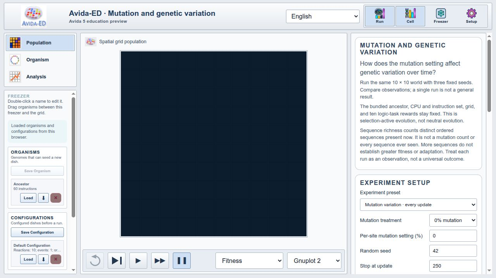
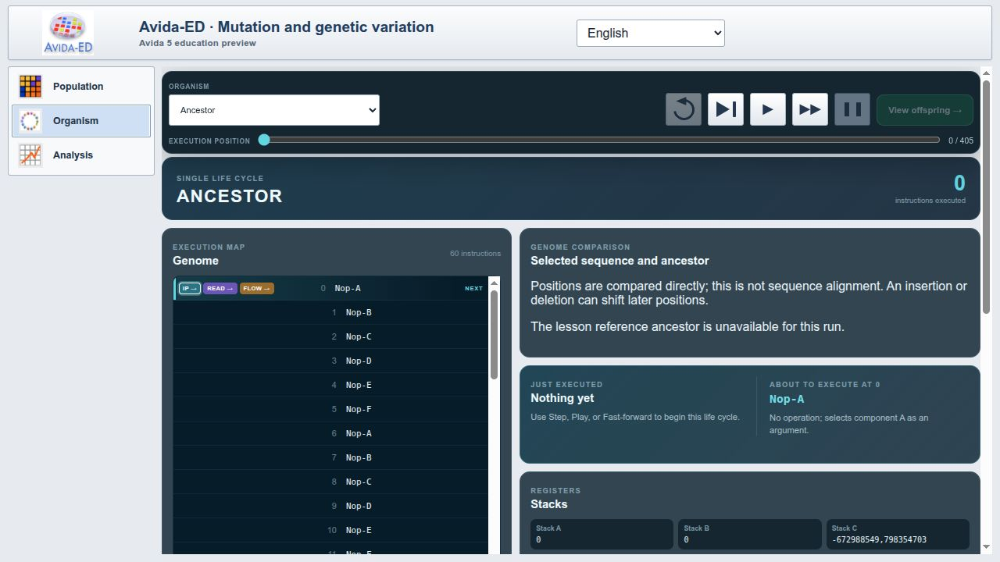
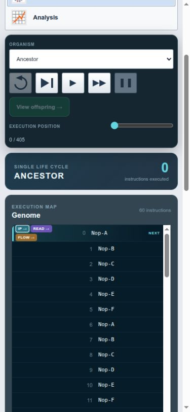
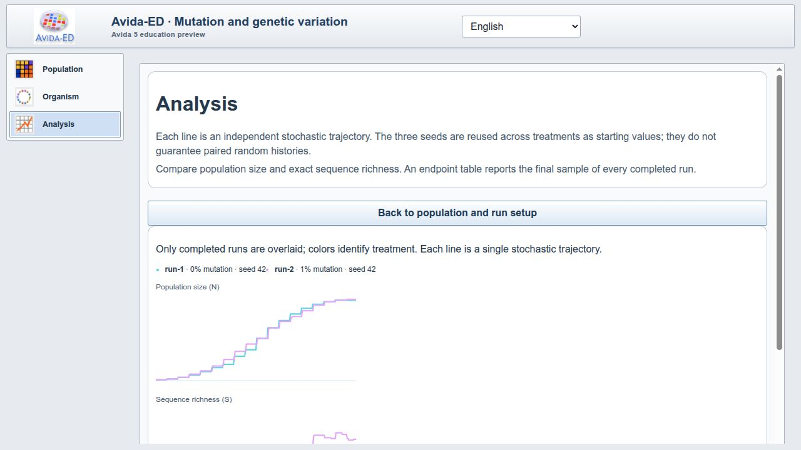
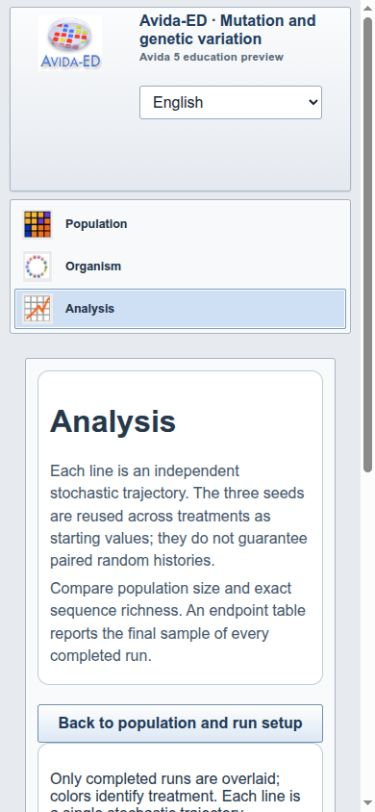
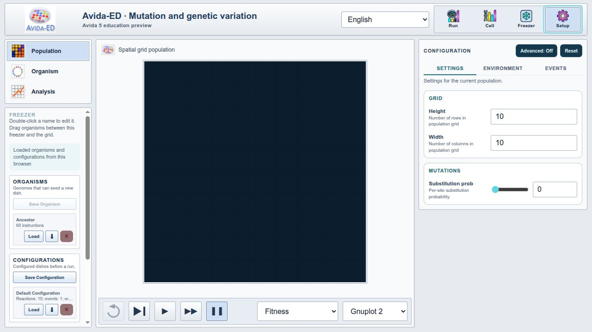

# Visual audit of operational interface claims

The visual pass found and corrected the reported Organism layout failure. It also corrected four related presentation defects: narrow-screen toolbar overflow, horizontal scrolling in the Freezer, low-contrast text in dark Organism panels and light configuration or selected-cell panels, and pale Analysis captions.

This review supports the port-status claim that the prototype's currently implemented surfaces are visible and usable at desktop and narrow widths. It does not establish tutorial-level parity with Avida-ED 4, validate the scientific wording, or replace instructor and learner review.

## Scope and method

The audit used the rebuilt WebAssembly application in a Chromium-based browser on 30 September 2026. The desktop viewport was 1280 × 720 pixels. The narrow viewport was 390 × 844 pixels.

The pass covered every interface area described as functional or available in the [Avida-ED 4 to 5 port assessment](port-status.html):

- Population navigation, setup, transport controls, grid, color controls, statistics, and recorded results.
- Organism selection, execution controls, genome, state panels, and selected-cell inspection.
- Analysis with two completed 250-update runs, one at each mutation treatment.
- Freezer organisms, configurations, checkpoints, and file-control layout.
- Configuration settings and their desktop and narrow layouts.

The review checked rendered placement, visibility, horizontal overflow, text contrast, and access to the primary content. It also exercised the controls needed to reach populated states. It did not perform every import, export, drag-and-drop, keyboard, or error-recovery path.

Starting the second Analysis run displayed the expected browser confirmation for replacing the active run. Accepting that dialog allowed the second 250-update run to complete normally; the pause was dialog handling, not evidence of a simulation-performance delay.

## Findings and disposition

| Area | Finding | Disposition |
| --- | --- | --- |
| Organism desktop layout | The Organism workspace occupied the 188-pixel sidebar column. Its controls overlapped, the main content was mostly obscured, and the view selector moved below the workspace. | Fixed the component order and explicit grid placement so the view selector remains in the left rail and Organism occupies the main column. |
| Organism narrow layout | The selector and transport controls required horizontal scrolling, and explicit desktop grid placement could create an off-screen implicit column. | Reset grid placement at the narrow breakpoint and wrap the selector and transport controls without page-level horizontal overflow. |
| Organism text contrast | Sequence-comparison notes inherited the light education theme's dark text while displayed on dark panels. | Applied an explicit foreground color to the Organism workspace. |
| Freezer | Intrinsic widths in checkpoint and item metadata created a horizontal scrollbar in the left rail. | Constrained the file row and nested sections, and limited the inspector to vertical scrolling. |
| Configure | Labels, descriptions, and active tabs inherited dark-theme colors that had weak contrast on the light education surface. | Added education-theme colors and light card surfaces for settings and structured configuration controls. |
| Selected cell | Summary text was faint, and the multicolumn genome list flowed into hidden horizontal columns. | Increased summary contrast and changed the genome list to one vertically scrollable column. |
| Analysis | The responsive layout worked, but chart captions were too pale on white. The apparent second-run delay was the expected new-run confirmation dialog awaiting a response. | Changed caption and result-context text to the standard education-theme foreground; accepted the confirmation and verified both 250-update runs completed. |
| Population | The desktop and narrow layouts kept controls and the grid in view without page-level horizontal overflow. | No structural change required beyond the Freezer fixes shared by this view. |

## Evidence

### Desktop Population

### Desktop Organism

### Narrow Organism

### Desktop Analysis

### Narrow Analysis

### Desktop Configure

## Remaining review work

The following work remains outside this pass:

- Walk representative Avida-ED 4 tutorial videos against the interface and record explicit exceptions.
- Repeat the workflow in a second browser and on the presentation laptop.
- Complete keyboard-only, import/export, drag-and-drop, and error-recovery checks.
- Review Spanish wording and scientific terminology with a fluent subject-matter reviewer.
- Obtain instructor and learner feedback before making classroom-readiness claims.
